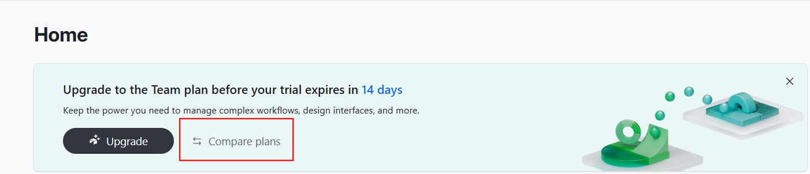
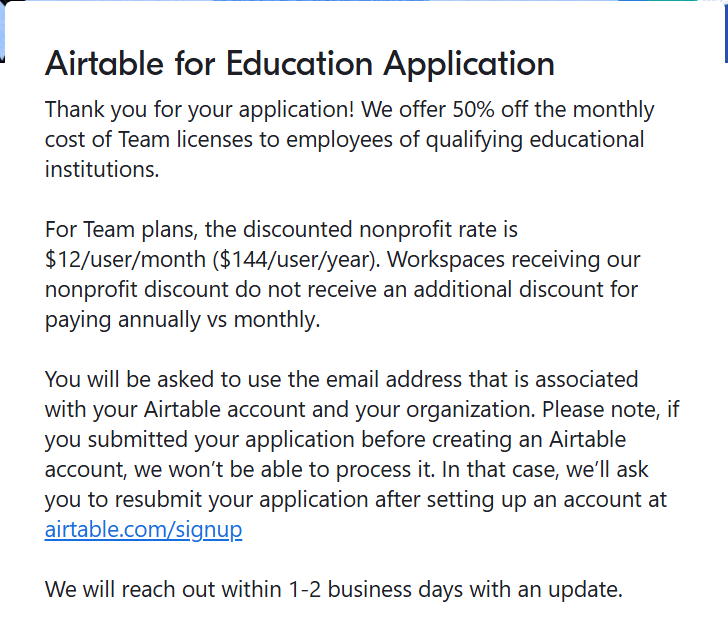

# Airtable Student Plan

Link: [https://airtable.com/](https://airtable.com/)

## Giới thiệu

Airtable là một nền tảng cộng tác trực tuyến mạnh mẽ, kết hợp tính linh hoạt của bảng tính với sức mạnh của cơ sở dữ liệu. Nó cho phép người dùng dễ dàng tạo và tùy chỉnh các không gian làm việc trực quan để quản lý dữ liệu, theo dõi dự án và tự động hóa quy trình làm việc một cách hiệu quả.

## Ưu đãi

* **Dùng thử gói Team trong 120 ngày:**  
  Sinh viên và giảng viên sở hữu địa chỉ email có đuôi ".edu" sẽ tự động được cấp quyền truy cập gói **Team** trong vòng **120 ngày** ngay sau khi tạo tài khoản Airtable và thiết lập workspace đầu tiên. Giai đoạn dùng thử này bắt đầu **ngay cả khi chưa được phê duyệt chính thức** cho gói miễn phí hoặc ưu đãi dài hạn.

* **Sau khi được duyệt:**  
  Người dùng đủ điều kiện có thể tiếp tục sử dụng gói Team miễn phí từ **6 đến 24 tháng**, tùy thuộc vào thời điểm tốt nghiệp dự kiến được khai báo trong hồ sơ đăng ký.

* **Tính năng của gói Team bao gồm:**
  - Tạo không giới hạn các cơ sở dữ liệu (bases).
  - Lưu trữ lên đến 50.000 bản ghi cho mỗi base.
  - Dung lượng tệp đính kèm lên đến 20 GB cho mỗi base.
  - Truy cập vào các tính năng nâng cao như biểu đồ, lịch, và các khối ứng dụng (apps).
  - Hỗ trợ tích hợp với các công cụ như Slack, Google Calendar và nhiều hơn nữa.
  
## Đăng ký

- **Bước 1:** Đăng nhập vào Airtable
- **Bước 2:** Ở trang home chọn Compare Plan

- **Bước 3:** Kéo xuống dưới cùng và chọn Education Plan

- **Bước 4:** Điền thông tin vào form gồm:
    - Họ tên, trường học, website trường học, vị trí của bạn trong trường học
    - Email sinh viên
    - Lí do vì sao dùng Airtable
    - Số lượng thành viên
    - Upload thẻ sinh viên, bảng điểm, thời khóa biểu

- **Bước 5:** Xác nhận
