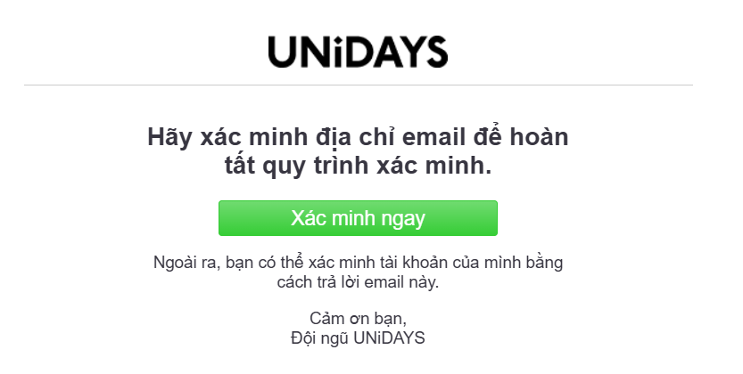

# Apple Store - Student Discount, Back To School 

Link: https://www.apple.com/vn-edu/store 

## Giới thiệu

Apple Store dành cho sinh viên là chương trình đặc biệt mang đến cơ hội mua các sản phẩm và phụ kiện của Apple với mức giá ưu đãi dành riêng cho sinh viên đang theo học tại các trường cao đẳng và đại học đủ điều kiện. Chương trình này giúp sinh viên tiếp cận các công nghệ của Apple, hỗ trợ học tập và phát triển với chi phí hợp lý hơn.

Chương trình Apple Back to School Việt Nam là ưu đãi mùa tựu trường khi mua Mac hoặc iPad tại Apple Store Giáo dục sẽ được giảm giá trực tiếp và tặng kèm phụ kiện như AirPods hoặc Apple Pencil. Apple Back To School chỉ áp dụng trong Thời Gian Khuyến Mại, cho đến khi hết hàng. 

## Ưu đãi
- Apple Back To School 2025: bắt đầu vào ngày 10 tháng 7 năm 2025 và kết thúc vào ngày 30 tháng 9 năm 2025. 
    Thông tin chi tiết và các sản phẩm khuyến mại trong chương trình tại: https://www.apple.com/vn-edu/shop/browse/home/back_to_school/terms_conditions 

- Giảm giá trên các sản phẩm như MacBook, Mac Mini, iPad, Apple Pencil, Smart Keyboard, AppleCare+ cho Mac và AppleCare+ cho iPad.

## Đăng ký

- **Bước 1:** Truy cập trang Apple Education Store (Link ở đầu trang).
- **Bước 2:** Chọn sản phẩm bạn muốn mua. 
    Đối với chương trình Apple Back To School, bạn nên xem các phụ kiện tặng kèm sản phẩm chọn mua trong Link thông tin chi tiết chương trình.
- **Bước 3:** Apple sẽ xác thực bạn là sinh viên thông qua UNiDAYS.
- **Bước 4:** Đăng ký tài khoản UNiDAYS.
- **Bước 5:** Chọn trường học: Ho Chi Minh City University of Information Technology, và nhập địa chỉ email sinh viên.
- **Bước 6:** Truy cập hộp thư đến của email sinh viên và xác minh tài khoản UNiDAYS.

