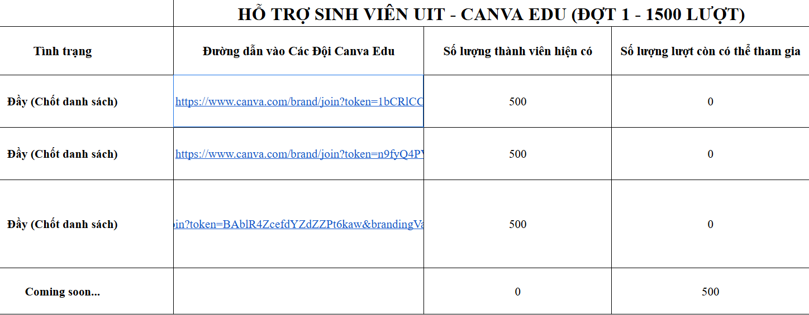

# Canva dành cho sinh viên UIT

Link: [Dành riêng cho sinh viên UIT](https://docs.google.com/spreadsheets/d/1IaZUsbzZto63C2sHaBut_TuYan6GFdk9QAKAiqaHid0/edit?fbclid=IwY2xjawKU5pJleHRuA2FlbQIxMABicmlkETFNUnFaUlNYWHhaRzJtOGlQAR6a3QtE5r_3ZubZ6O977Y_2I9P0yz7NWT_3jKYy8AjU3pMBj4v9C1t4PBwlXw_aem_Bs0LHtdHawi4sxQlpZT8iQ&gid=0#gid=0)

## Giới thiệu

Canva là một công cụ thiết kế đồ họa trực tuyến phổ biến, cung cấp vô số mẫu và tính năng mạnh mẽ để tạo ra các thiết kế ấn tượng. Chương trình Canva dành cho sinh viên UIT mang đến quyền truy cập miễn phí vào các tính năng cao cấp của Canva Pro, hỗ trợ sinh viên trong học tập và các hoạt động ngoại khóa liên quan đến thiết kế.

# Ưu đãi

* **Truy cập đầy đủ Canva Pro:**
  - Hơn 100 triệu stock ảnh, video chất lượng cao
  - Thư viện template chuyên nghiệp đa dạng
  - Công cụ chỉnh sửa ảnh nâng cao
  - Tính năng Magic Write hỗ trợ AI
  - Brand Kit để quản lý bộ nhận diện

* **Đặc quyền riêng:**
  - Lưu trữ không giới hạn
  - Xuất file chất lượng cao
  - Làm việc nhóm không giới hạn thành viên
  - Truy cập các khóa học thiết kế từ Canva

## Đăng ký

- **Bước 1:** Đăng nhập vào Canva bằng tài khoản email sinh viên của Trường Đại học Công nghệ Thông tin (UIT): **[tên_tài_khoản]@gm.uit.edu.vn**.
- **Bước 2:** Truy cập vào đường link đã cung cấp và chọn một nhóm (team) còn chỗ trống.

- **Bước 3:** Kiểm tra các tính năng nâng cao như Brand Kit, Magic Write,... Nếu bạn có thể sử dụng các tính năng này, quá trình đăng ký đã thành công.

## Lưu ý

- Chương trình chỉ chấp nhận tài khoản email sinh viên có đuôi **@gm.uit.edu.vn**.
- Bạn chỉ có thể đăng ký thành công nếu có nhóm (team) nào trong danh sách liên kết còn chỗ trống.
