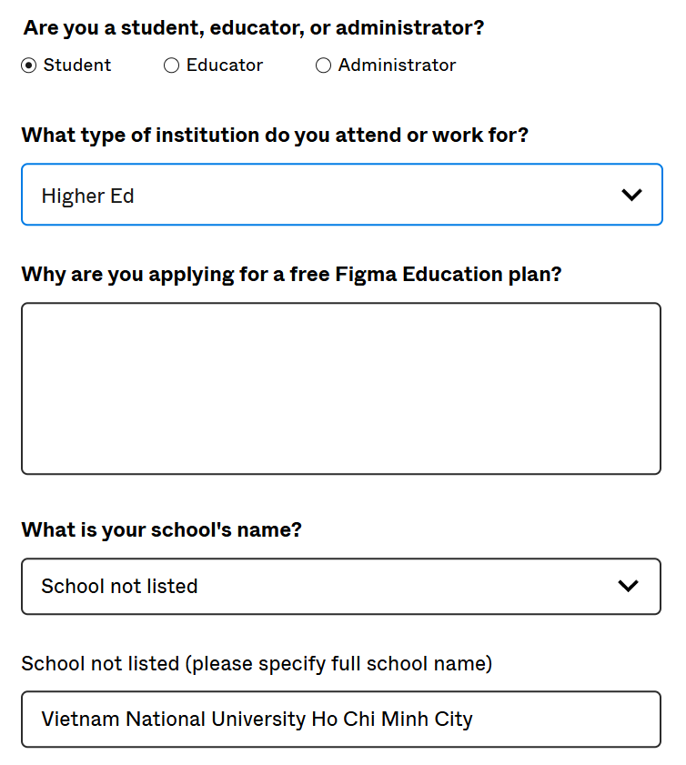

# Figma for Education

Link: [https://www.figma.com/education/](https://www.figma.com/education/)

## Giới thiệu

Figma là một công cụ thiết kế giao diện người dùng (UI) và trải nghiệm người dùng (UX) mạnh mẽ, được sử dụng rộng rãi trong ngành công nghiệp. Chương trình Figma dành cho giáo dục cung cấp quyền truy cập miễn phí vào các tính năng chuyên nghiệp của Figma cho sinh viên và giảng viên, hỗ trợ quá trình học tập, giảng dạy và cộng tác trong các dự án thiết kế.

## Ưu đãi

* **Figma Professional miễn phí:**  
  - Tạo không giới hạn các file thiết kế và prototype.
  - Mời cộng tác viên vào dự án không giới hạn số lượng.
  - Quản lý quyền truy cập và phân quyền theo vai trò.
  - Tích hợp mạnh mẽ với các công cụ như Slack, Notion, Jira, v.v.
  - Hỗ trợ version history và các tính năng nâng cao khác.

* **FigJam Professional miễn phí:**  
  - Sử dụng bảng trắng kỹ thuật số để ghi chú, lập kế hoạch và brainstorm.
  - Cộng tác trực tiếp theo thời gian thực với nhóm hoặc lớp học.
  - Các mẫu (template) giáo dục có sẵn để dễ dàng bắt đầu.

## Đăng ký

- **Bước 1:** Truy cập trang Figma dành cho giáo dục theo đường link trên và đăng nhập bằng địa chỉ email sinh viên của bạn.
- **Bước 2:** Chọn vai trò của bạn (ví dụ: sinh viên) và tên tổ chức (trường học của bạn).
- **Bước 3:** Nhập lý do bạn muốn đăng ký tài khoản Figma dành cho giáo dục.
- **Bước 4:** Chọn tên trường học và ngành học của bạn từ danh sách có sẵn.
- **Bước 5:** Tải lên bản sao lịch học hiện tại hoặc bảng điểm học tập của bạn để xác minh tình trạng sinh viên.
- **Bước 6:** Nhập thời gian dự kiến bạn tốt nghiệp.

