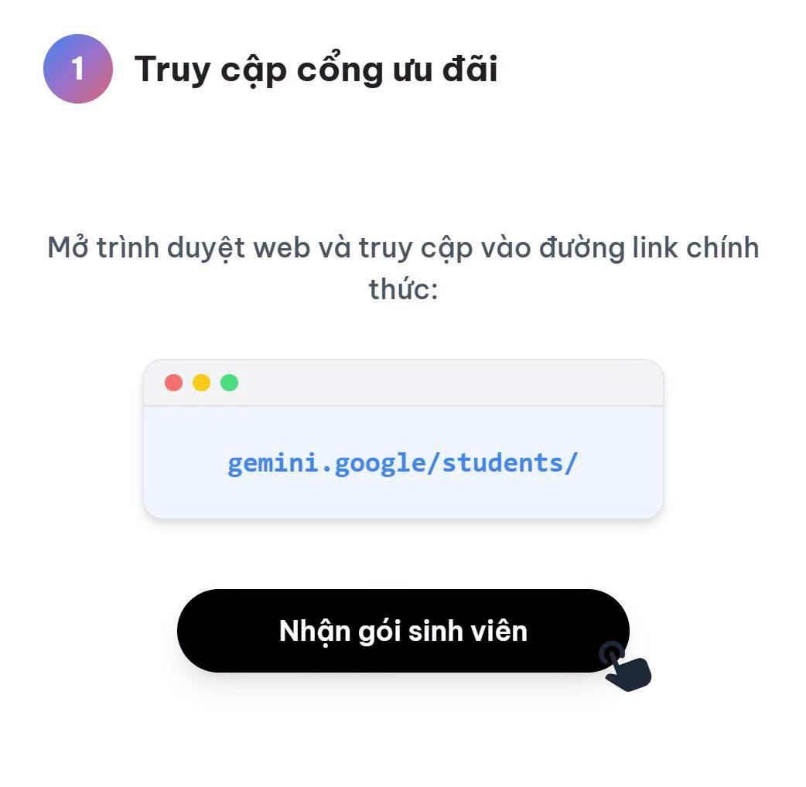
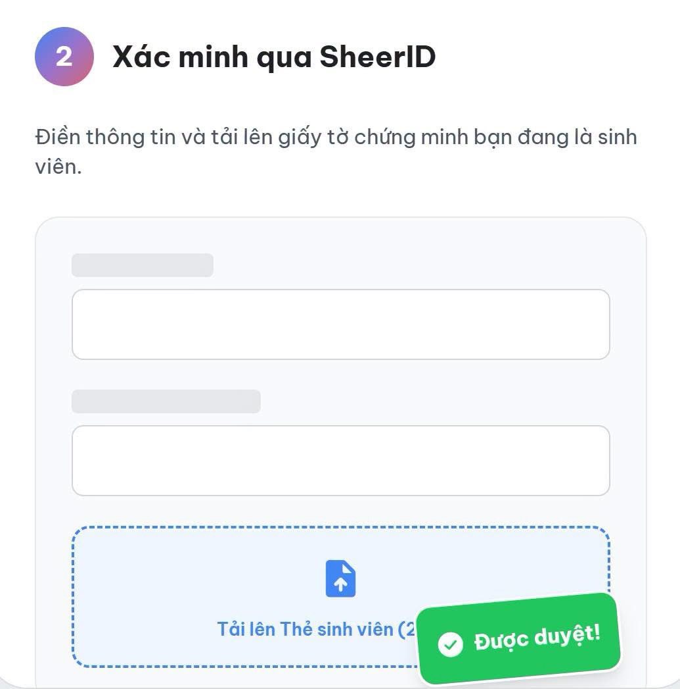
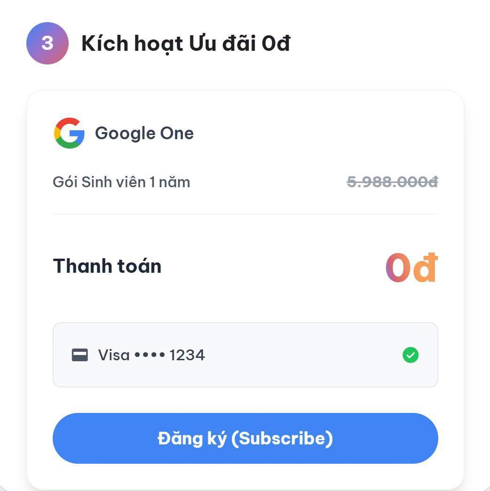

# Google Gemini Plus (Google AI Plus)

Link: [https://gemini.google/students/](https://gemini.google/students/)

## Giới thiệu

Google vừa chính thức triển khai gói ưu đãi **Google AI Plus** miễn phí trong 1 năm dành cho sinh viên đại học tại Việt Nam. Đây là bộ công cụ hỗ trợ xử lý dữ liệu và học tập với các tính năng vượt trội, mang lại trải nghiệm AI tối ưu nhất.

## Ưu đãi

Khi kích hoạt thành công, sinh viên sẽ nhận được các quyền lợi sau:
* **Miễn phí 1 năm gói Google AI Plus**.
* **Dung lượng và hạn mức:** Tài khoản được nâng cấp bộ nhớ đám mây lên **400GB** và **không giới hạn** dung lượng tải tệp tài liệu học tập.
* **Nhân đôi hạn mức truy cập** mô hình AI.
* **Sổ ghi chú học tập:** Tính năng giúp tự động chuyển đổi slide hay ghi chú bài giảng thành đề ôn tập, bản tóm tắt và file âm thanh.
* **Gemini Omni:** Tính năng tạo video thông minh.
* **Gemini Live:** Đàm thoại, giao tiếp trực tiếp với trợ lý AI.
* **Deep Research:** Phân tích báo cáo chuyên sâu.
* **Hỗ trợ học tập:** Giải bài tập từng bước qua tệp hình ảnh.
* Ngoài ra, không gian làm việc của Gemini còn tích hợp tính năng **Canvas** để hỗ trợ tạo ảnh và tối ưu nội dung bài viết.

## Đăng ký

- **Bước 1: Truy cập cổng ưu đãi**
  Mở trình duyệt web và truy cập vào đường link chính thức của chương trình `gemini.google/students/`, sau đó nhấn nút "Nhận gói sinh viên".
    

    

    

- **Bước 2: Xác minh qua SheerID**
  Điền thông tin và tải lên giấy tờ chứng minh bạn đang là sinh viên.
    

    

    

- **Bước 3: Kích hoạt Ưu đãi 0đ**
  Hoàn tất thanh toán (thêm thẻ Visa/Mastercard) để đăng ký gói Sinh viên 1 năm với giá 0đ.
    

    

    

## Các lưu ý quan trọng về chính sách và cách sử dụng

- **Gia hạn tự động:** Hệ thống sẽ tự động gia hạn với giá gốc sau khi kết thúc 12 tháng ưu đãi. Mẹo nhỏ: Ngay sau khi đăng ký, hãy vào Cài đặt Google One và **Tắt gia hạn tự động**. Bạn vẫn được dùng 1 năm miễn phí mà không lo bị trừ tiền oan!
- **Độ tuổi và đối tượng:** Áp dụng cho sinh viên đại học từ 18 đến 24 tuổi. Ưu đãi này áp dụng cho cả tài khoản mới và **tài khoản từng dùng thử gói AI Pro năm 2025**.
- **Xác minh điều kiện:** Hệ thống yêu cầu xác minh tư cách sinh viên định kỳ hàng năm để tiếp tục duy trì ưu đãi.
- **Phương pháp tối ưu:** Bạn nên tải trước tài liệu hoặc đề cương môn học vào hệ thống trước khi đặt câu hỏi để Gemini có thể đưa ra câu trả lời bám sát chương trình học.