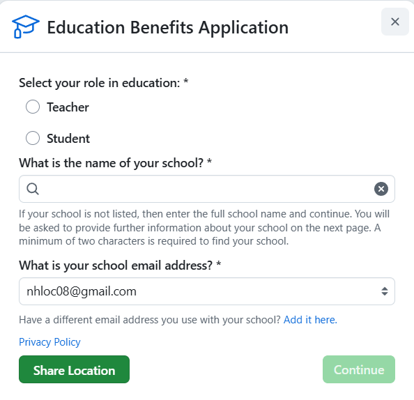

# Github Education
Link: https://github.com/education/students

## Giới thiệu

GitHub Education cung cấp cho sinh viên quyền truy cập miễn phí vào các công cụ và tài nguyên phát triển mạnh mẽ, thường được sử dụng trong ngành công nghiệp phần mềm. Chương trình này giúp sinh viên nâng cao kỹ năng lập trình, cộng tác trong các dự án và làm quen với quy trình làm việc thực tế.

## Ưu đãi

Với GitHub Education, sinh viên sẽ được hưởng các lợi ích sau:

* **GitHub Pro:** Truy cập miễn phí vào tất cả các tính năng "Pro" của GitHub, bao gồm:
  - Kho lưu trữ riêng tư không giới hạn.
  - Công cụ quản lý dự án nâng cao như Projects và Insights.
  - Tăng hạn mức sử dụng GitHub Actions và Codespaces.

* **GitHub Codespaces:** Môi trường phát triển dựa trên trình duyệt, cho phép bạn:
  - Viết, chạy và gỡ lỗi mã từ bất kỳ đâu.
  - Sinh viên được cấp 180 giờ sử dụng Codespaces mỗi tháng và 20 GB dung lượng lưu trữ.

* **GitHub Actions:** Nền tảng tự động hóa quy trình làm việc, hỗ trợ:
  - Tự động hóa các tác vụ như kiểm tra, xây dựng và triển khai phần mềm.
  - Sinh viên nhận được 3.000 phút sử dụng GitHub Actions mỗi tháng.

* **GitHub Pages:** Dịch vụ lưu trữ trang web tĩnh miễn phí, cho phép bạn:
  - Tạo một trang web cá nhân hoặc giới thiệu dự án trực tiếp từ kho lưu trữ GitHub.
  - Hỗ trợ tên miền tùy chỉnh và tích hợp dễ dàng với Jekyll.

* **Gói ưu đãi từ các đối tác:** Quyền truy cập miễn phí hoặc giảm giá cho nhiều công cụ và dịch vụ phát triển phổ biến khác thông qua GitHub Student Developer Pack, bao gồm:
  - JetBrains (IntelliJ IDEA, PyCharm, v.v.)
  - Namecheap (miễn phí tên miền .me trong 1 năm)
  - Microsoft Azure, DigitalOcean, Heroku (tín dụng dịch vụ đám mây)
  - DataCamp, Educative, Frontend Masters (khóa học lập trình)
  - MongoDB Atlas, GitKraken, GitLens, và nhiều hơn nữa.

## Đăng ký

- **Bước 1:** Đăng nhập vào tài khoản GitHub hiện có của bạn.
- **Bước 2:** Truy cập mục **Education Benefits** (Quyền lợi giáo dục).
- **Bước 3:** Chọn vai trò của bạn (ví dụ: Student), nhập tên trường học và địa chỉ email sinh viên của bạn. **Lưu ý:** Nếu tài khoản GitHub của bạn được tạo bằng email cá nhân, bạn cần thêm địa chỉ email sinh viên vào tài khoản GitHub của mình.
- **Bước 4:** Chụp ảnh thẻ sinh viên của bạn. Đảm bảo rằng ảnh chụp rõ ràng và bao gồm đầy đủ các thông tin sau: **ngày hết hạn** của thẻ và **mã số sinh viên**.

