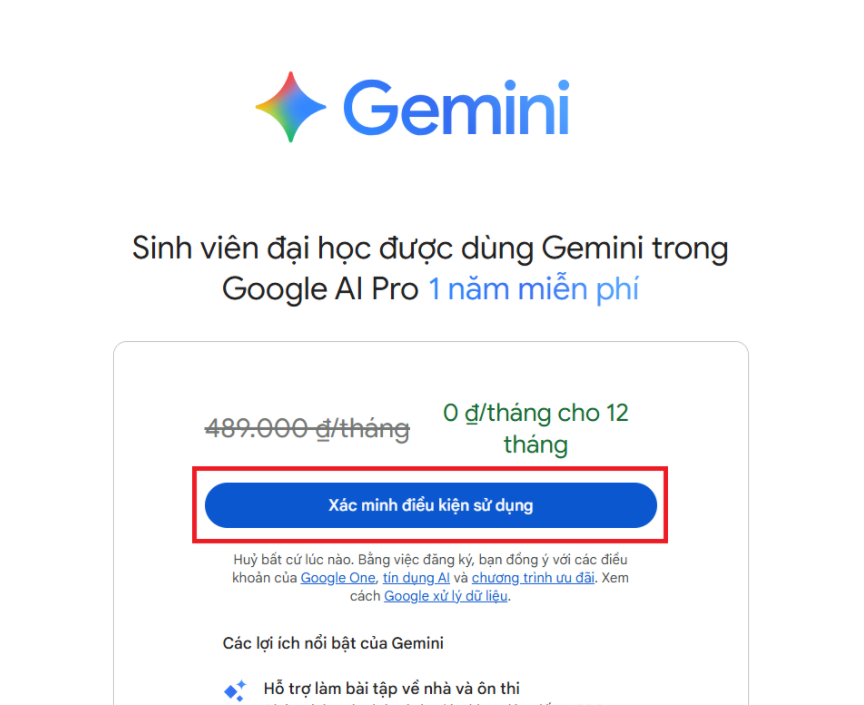
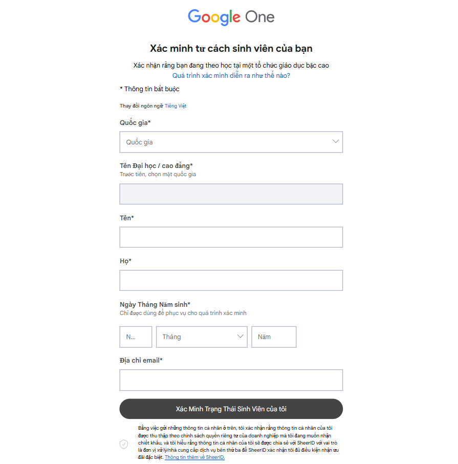
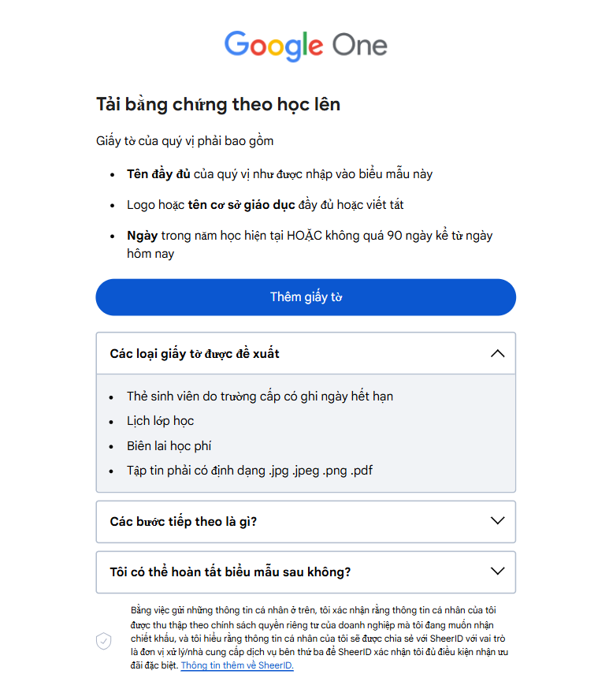
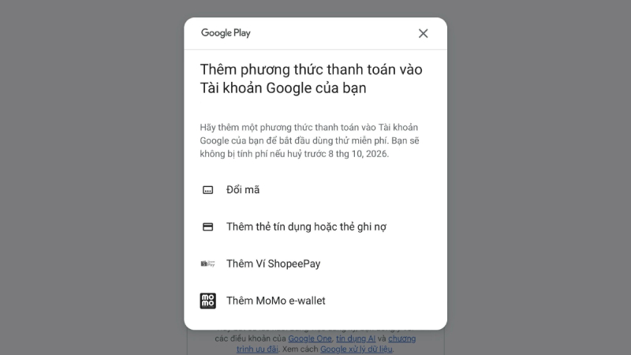

# Google AI Pro

Link: [https://one.google.com/ai-student](https://one.google.com/ai-student)

## **Giới thiệu**

**Google AI Pro** là gói quyền truy cập nâng cao vào các công cụ trí tuệ nhân tạo của Google, giúp người dùng *học tập, nghiên cứu khoa học và sáng tạo* hiệu quả hơn.

Sinh viên được trải nghiệm **Gemini Advanced (Gemini 2.5 Pro)** — mô hình AI mạnh mẽ nhất của Google, cùng với **2 TB dung lượng lưu trữ Google One miễn phí trong 12 tháng**.

Đặc biệt, gói này bao gồm **NotebookLM** — công cụ hỗ trợ **nghiên cứu khoa học và học thuật** vượt trội, giúp phân tích, tóm tắt và tổng hợp nội dung từ tài liệu, giáo trình hay bài báo một cách thông minh. Đây là **trợ lý nghiên cứu thế hệ mới**, giúp sinh viên và giảng viên tiết kiệm thời gian và tăng hiệu quả học thuật.

Gói **AI Pro** tích hợp sâu với hệ sinh thái Google, cho phép sử dụng **Gemini và NotebookLM** trong Gmail, Tài liệu, Sheets, Drive, và nhiều ứng dụng khác, mang đến môi trường làm việc và nghiên cứu toàn diện, hiện đại.

---

## **Ưu đãi**

Với **Google AI Pro**, sinh viên sẽ được hưởng các lợi ích sau:

* **Gemini Advanced (Gemini 2.5 Pro):** Quyền truy cập vào mô hình AI mạnh nhất của Google với tính năng Deep Research, hỗ trợ viết, tra cứu và phân tích chuyên sâu.  
* **Tạo video bằng AI (Veo, Flow, Whisk):** Dựng phim, tạo video hoặc hình ảnh minh hoạ bằng trí tuệ nhân tạo với 1.000 tín dụng AI mỗi tháng.  
* **NotebookLM:** Trợ lý nghiên cứu và viết lách thông minh, hỗ trợ tạo bản tóm tắt và ghi chú tự động, tăng giới hạn sử dụng gấp 5 lần so với bản thường.  
* **Google Search (AI Mode):** Sử dụng mô hình Gemini 2.5 Pro trong chế độ AI, giúp tìm kiếm và phân tích nội dung sâu hơn.  
* **Gemini Code Assist & Gemini CLI:** Hạn mức yêu cầu cao hơn trong các công cụ dành cho lập trình viên.  
* **Tích hợp trong Gmail, Docs, Sheets, Drive:** Sử dụng Gemini ngay trong các ứng dụng quen thuộc để viết, soạn thảo và quản lý công việc nhanh chóng.  
* **2 TB bộ nhớ Google One:** Dung lượng dùng chung cho **Drive, Photos và Gmail**, giúp lưu trữ học liệu và dự án mà không lo đầy bộ nhớ.

---

## **Đăng ký**

**Bước 1.** Truy cập [Google One AI Student](https://one.google.com/ai-student?g1_landing_page=75).  
**Bước 2.** Chọn “Xác minh tư cách sinh viên”.  

   

**Bước 3.** Xác minh qua SheerID:  
   - Đăng ký bằng *email sinh viên UIT* (mssv@gm.uit.edu.vn).  
    
   - Nếu được yêu cầu, tải lên *thẻ sinh viên hoặc giấy xác nhận sinh viên*. 
    
   - Việc xác minh có thể mất tối đa *48 giờ*.  
   - Kiểm tra cả thư mục *Spam* để nhận email xác nhận.  

**Bước 4.** Sau khi được xác minh, truy cập lại *Google One* → chọn *“Đăng ký Google AI Pro”* → *“Nhận ưu đãi cho sinh viên”*.  

**Bước 5.** Thêm hoặc chọn phương thức thanh toán để hoàn tất đăng ký.  

   

---

## **Lưu ý**

* Ưu đãi chỉ dành cho sinh viên từ 18 tuổi trở lên, xác minh qua SheerID và cần có **phương thức thanh toán hợp lệ**.  
* Chương trình đăng ký kết thúc **ngày 9/12/2025**. Sau thời gian miễn phí, gói sẽ tự động gia hạn theo giá thường nếu không hủy.  
* Nếu chỉ dùng để học hoặc trải nghiệm, hãy hủy sau 1 năm để tránh bị trừ phí.  
* Không nên lưu dữ liệu quan trọng vào 2TB Google One nếu không có nhu cầu lâu dài, vì sau khi hết hạn, dung lượng vượt mức miễn phí có thể bị giới hạn truy cập.

---

### **Cách hủy tự động gia hạn**

1. Truy cập [Google One](https://one.google.com/) trên máy tính.  
2. Nhấp vào biểu tượng Cài đặt ⚙️ → “Huỷ gói thành viên”.  
3. Chọn “Hủy gói dịch vụ” để xác nhận.  

Sau khi hoàn tất, bạn sẽ nhận được thông báo xác nhận rằng gói thuê bao đã được huỷ thành công.