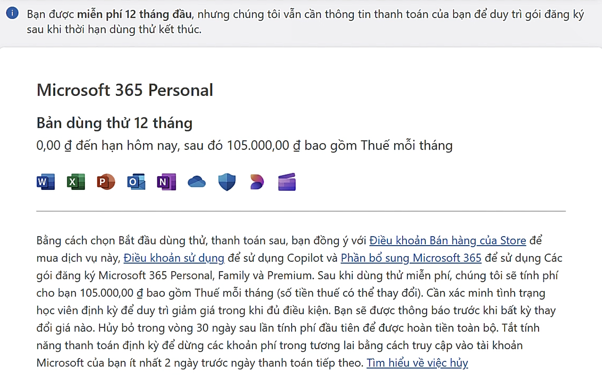
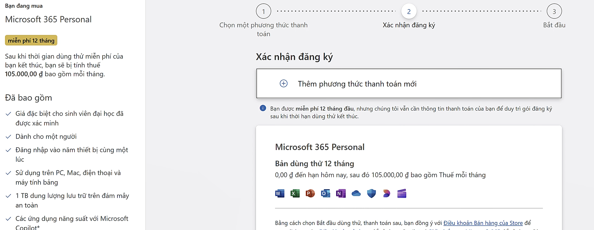
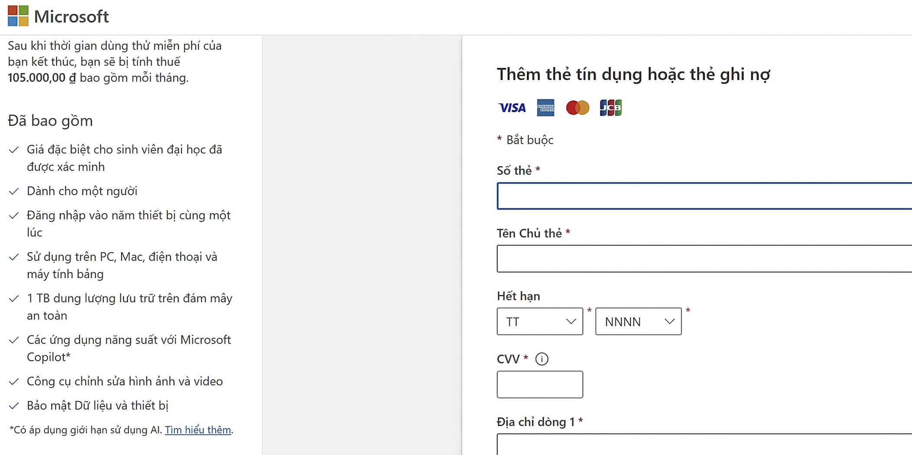
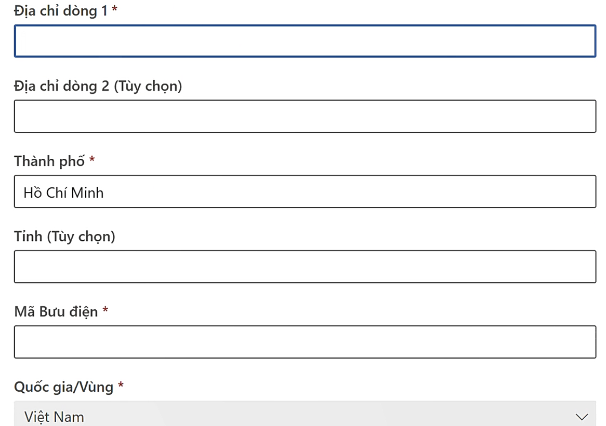
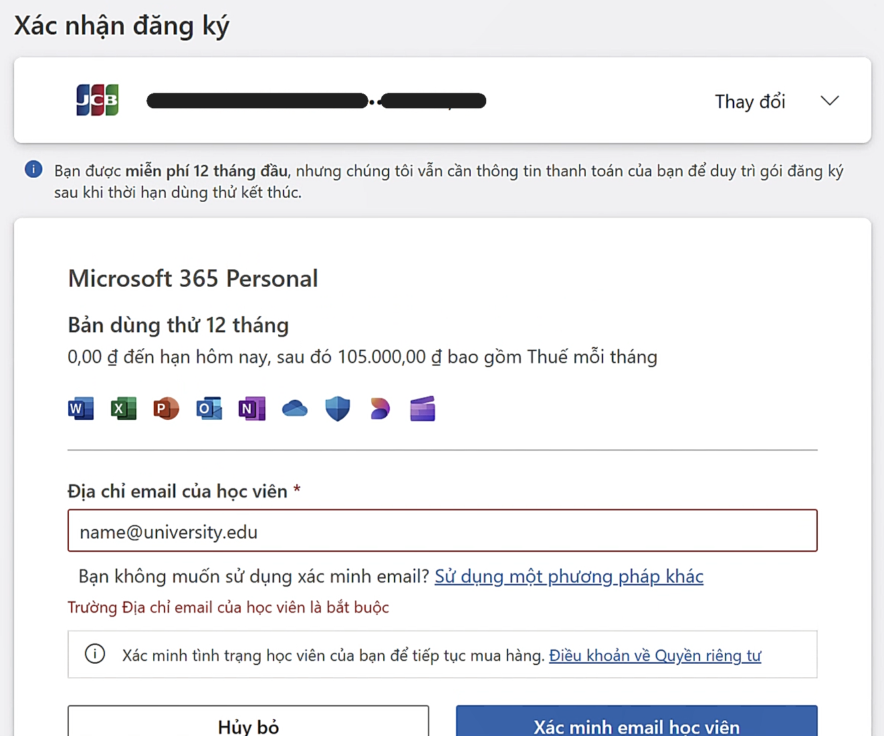
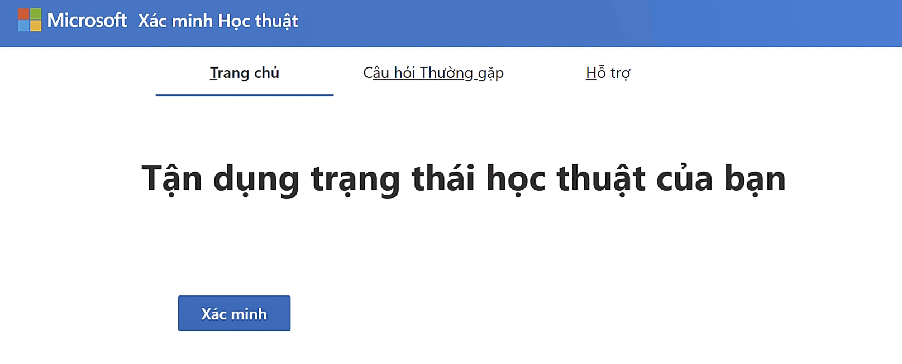

# Microsoft 365 Personal - College Student Pricing 
*Thời gian đăng ký: đến **31/10/2025** hoặc đến khi hết nguồn cung.*

Link: https://www.microsoft.com/en-us/microsoft-365/college-student-pricing

## Giới thiệu

Microsoft muốn hỗ trợ sinh viên tiếp cận các công cụ năng suất (Word, Excel, PowerPoint, Outlook, OneNote…) và các tính năng AI (Copilot) dễ dàng hơn bằng cách thay vì mua bản Office truyền thống, sinh viên có thể dùng gói đăng ký Microsoft 365 cá nhân với ưu đãi đặc biệt — dùng bản đầy đủ ứng dụng + các tiện ích đám mây + bảo mật … với chi phí thấp hơn đáng kể so với gói tiêu chuẩn.

## Ưu đãi

* **Microsoft 365 Personal:** 

    - Bộ ứng dụng Office (Word, Excel, PowerPoint, Outlook, OneNote) cài đặt trên máy tính + sử dụng online và có Al hỗ trợ ([có giới hạn](https://support.microsoft.com/vi-vn/office/t%C3%ADn-d%E1%BB%A5ng-ai-v%C3%A0-gi%E1%BB%9Bi-h%E1%BA%A1n-cho-microsoft-365-personal-gia-%C4%91%C3%ACnh-v%C3%A0-premium-68530f1a-4459-4d02-9818-8233c1f673b8))
    - Dung lượng lưu trữ đám mây **1TB OneDrive** để lưu tài liệu, ảnh, dự án. 
    - Tính năng bảo mật nâng cao: chống phần mềm độc hại, bảo vệ dữ liệu, các lớp bảo mật bổ sung.
    - Hỗ trợ đồng bộ và làm việc trên đa thiết bị (máy tính, điện thoại, tablet). 

* **Giá ưu đãi đặc biệt:** Dùng *miễn phí 12 tháng* Microsoft 365 Personal nếu bạn là sinh viên và xác minh được bằng email trường học. Sau đó, bạn được tiếp tục sử dụng với giá ~50 % so với mức giá tiêu chuẩn của Microsoft 365 Personal.

## Đăng ký

- **Bước 1:** Truy cập trang Microsoft 365 Personal - College Student Pricing theo đường link trên và nhấn nút **Sign up** để bắt đầu nhận ưu đãi.
- **Bước 2:** Đăng nhập vào tài khoản Microsoft của bạn hoặc bằng địa chỉ email của bạn.
- **Bước 3:** Sau khi đăng nhập sẽ hiển thị các bước mua Microsoft 365 Personal miễn phí 12 tháng. 

Nhấp vào *Tiếp theo*.
- **Bước 4:** **Thêm phương thức thanh toán** bằng cách điền thông tin thẻ tín dụng hoặc thẻ ghi nợ.

Các bạn nhớ kiểm tra lại *Mã bưu điện* với địa chỉ các bạn sau khi sáp nhập Tỉnh.

- **Bước 5:** **Xác nhận đăng ký** 

Nhập vào mail sinh viên của bạn để Microsoft xác minh học thuật và hoàn tất xác nhận đăng ký.

