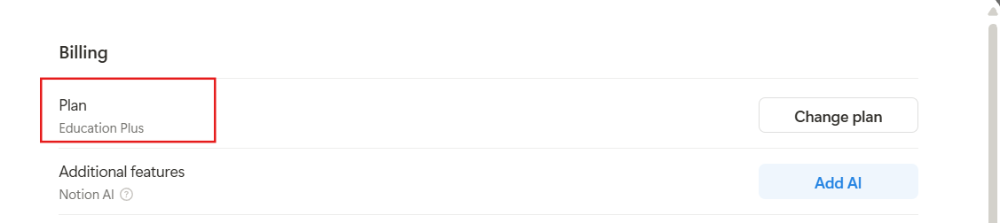

# Notion For Education

Link: https://www.notion.com/product/notion-for-education

## Giới thiệu

Notion là một không gian làm việc đa năng, hỗ trợ ghi chú, quản lý dự án, tạo cơ sở dữ liệu và nhiều hơn nữa. Chương trình Notion for Education cung cấp cho sinh viên và giảng viên quyền truy cập miễn phí vào các tính năng nâng cao của Notion Plus, giúp tối ưu hóa việc học tập, nghiên cứu và cộng tác.

## Ưu đãi

* **Notion Plus miễn phí cho sinh viên và giảng viên:**
  - Tạo không giới hạn các trang và khối nội dung.
  - Tải lên tệp tin không giới hạn.
  - Lưu trữ lịch sử chỉnh sửa trong 30 ngày.
  - Mời tối đa 100 khách vào workspace.
  - Tùy chỉnh workspace theo nhu cầu cá nhân.
  - Quyền truy cập ưu tiên vào hỗ trợ khách hàng.

* **Giảm giá 50% cho Notion AI:**
  - Hỗ trợ viết nội dung, tạo ý tưởng và cải thiện văn phong.
  - Tự động hóa các tác vụ lặp đi lặp lại.
  - Giá ưu đãi: $5/tháng hoặc $4/tháng khi thanh toán hàng năm.
  - Ưu đãi kéo dài trong 12 tháng kể từ khi kích hoạt.

* **Gói miễn phí cho tổ chức sinh viên:**
  - Workspace với số lượng thành viên không giới hạn.
  - Tất cả các tính năng của gói Plus.
  - Quản lý dự án, sự kiện và tài nguyên chung hiệu quả.
  - Yêu cầu xác minh tổ chức sinh viên từ trường đại học.

## Đăng ký

- **Bước 1:** Truy cập trang Notion for Education theo đường link trên và nhấn nút **Get Notion free** để bắt đầu quá trình đăng ký.
- **Bước 2:** Đăng nhập vào tài khoản Notion hiện có của bạn hoặc tạo một tài khoản mới bằng địa chỉ email sinh viên của bạn.
- **Bước 3:** Sau khi đăng nhập, truy cập vào phần **Settings & members** (Cài đặt & thành viên), sau đó chọn **Upgrade plan** (Nâng cấp gói).
- **Bước 4:** Chọn gói **Education** hoặc **Education Plus**. Notion sẽ tự động xác thực điều kiện của bạn dựa trên địa chỉ email sinh viên.
- **Bước 5:** Để kiểm tra xem bạn đã nâng cấp thành công hay chưa, hãy vào phần **Billing** (Thanh toán). Nếu bạn thấy gói hiển thị là **Plan Education Plus**, nghĩa là bạn đã đăng ký thành công.

