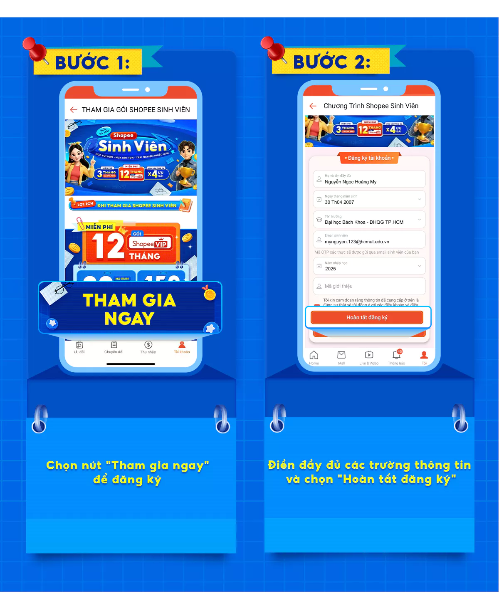
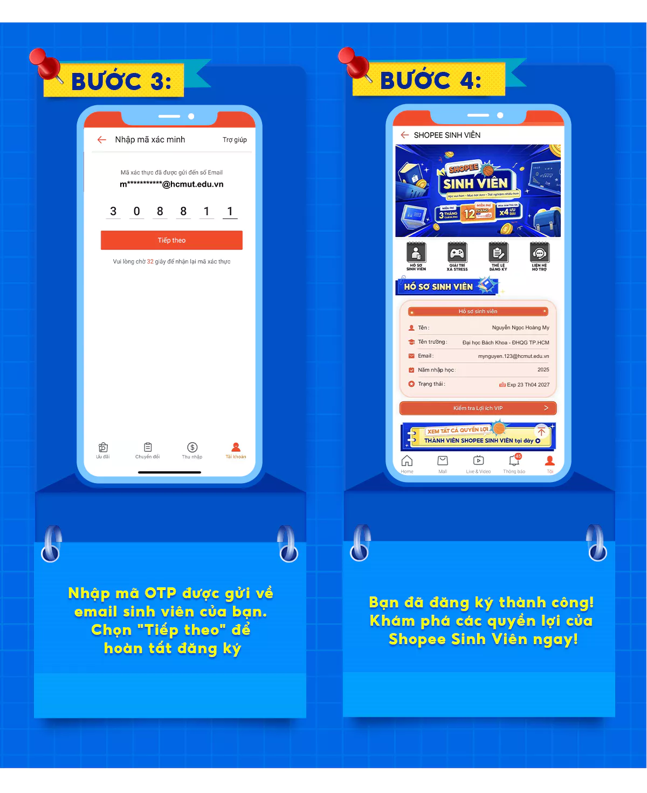

# Shopee Sinh Viên

Link: [https://shopee.vn/m/introduce-goi-ShopeeSinhVien](https://shopee.vn/m/introduce-goi-ShopeeSinhVien)

## Giới thiệu

Shopee Sinh Viên là chương trình dành cho học sinh, sinh viên sở hữu email đuôi .edu, giúp kích hoạt miễn phí gói ShopeeVIP 12 tháng (bình thường có giá 119.000đ). ShopeeVIP là gói hội viên trả phí của Shopee, mang lại các voucher ưu đãi giá trị cao mỗi tháng.

## Ưu đãi

* **ShopeeVIP miễn phí 12 tháng** dành cho sinh viên, thay vì phải mua với giá 119.000đ.
* **Quyền lợi chính của ShopeeVIP:** Voucher giảm 15% (tối đa 1.000.000đ) cho đơn hàng từ 1.000.000đ trở lên, được cấp hằng tháng trong suốt thời hạn gói.
* **Quyền lợi bổ sung (thay đổi theo từng thời điểm):** ưu đãi phí vận chuyển, ưu đãi ShopeePay, ShopeeFood, và các ưu đãi từ đối tác (ví dụ từng có đợt Canva Pro dùng thử 3 tháng, Klook, VNPT VinaPhone...). Các ưu đãi này không cố định, sinh viên nên theo dõi mục ShopeeVIP trên app để cập nhật ưu đãi mới nhất.

## Đăng ký

- **Bước 1:** Truy cập trang đăng ký Shopee Sinh Viên theo đường link ở trên.
- **Bước 2:** Điền đầy đủ thông tin cá nhân gồm họ tên, ngày sinh, chọn trường UIT, nhập địa chỉ email sinh viên (đuôi `@gm.uit.edu.vn` hoặc email trường quy định).
    

    

    

- **Bước 3:** Shopee gửi mã OTP về email sinh viên. Mở email, lấy mã OTP và nhập vào biểu mẫu để hoàn tất xác thực.
- **Bước 4:** Vào mục ShopeeVIP trên app để kiểm tra và sử dụng voucher đã nhận (mục Kho Voucher > ShopeeVIP).
    

    

    

## Lưu ý

- Email sinh viên phải còn hoạt động để nhận OTP (kiểm tra cả mục Spam nếu chưa thấy).
- Các ưu đãi từ đối tác (như Canva Pro) là chương trình riêng, có thời hạn, không phải quyền lợi cố định đi kèm ShopeeVIP.

Nếu đăng ký các ưu đãi đối tác này, một số chương trình sẽ yêu cầu nhập phương thức thanh toán ngay từ đầu. Sau khi hết thời gian dùng thử, hệ thống sẽ **tự động gia hạn và thu phí** nếu bạn không chủ động hủy trước thời hạn, vì vậy hãy nhớ đặt lịch nhắc hủy nếu chỉ muốn dùng thử.