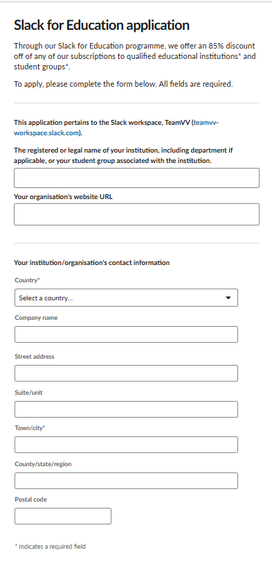
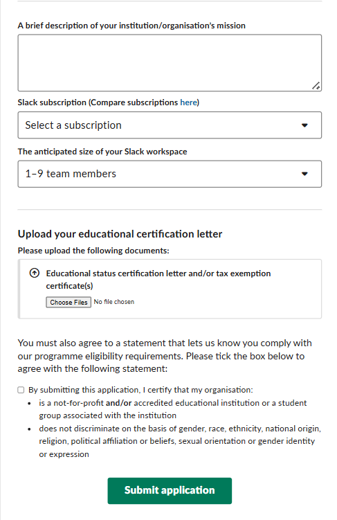

# Slack For Education Discount

Link: https://slack.com/intl/en-gb/help/articles/206646877-Apply-for-the-Slack-for-Education-discount

## Giới thiệu

Slack là một nền tảng giao tiếp và cộng tác nhóm phổ biến, được sử dụng rộng rãi trong các tổ chức và doanh nghiệp. Chương trình Slack for Education Discount mang đến ưu đãi về giá cho các tổ chức giáo dục đủ điều kiện, giúp các trường học và sinh viên tận dụng hiệu quả các tính năng của Slack trong việc giao tiếp, làm việc nhóm và quản lý lớp học.

## Ưu đãi

* **Giảm giá sâu:**
  - Giảm đến 85% so với gói thương mại
  - Chỉ từ $0.99/user/tháng cho gói Pro

* **Tính năng cao cấp:**
  - Kết nối không giới hạn với các tổ chức ngoài
  - Lịch sử tin nhắn không giới hạn
  - Hội nghị truyền hình chất lượng cao
  - Tích hợp với Google Drive, Microsoft Office 365

## Đăng ký

- **Bước 1:** Tạo một tài khoản Slack mới hoặc đăng nhập vào tài khoản Slack hiện có của bạn.
- **Bước 2:** Tạo một Workspace mới cho tổ chức giáo dục của bạn hoặc truy cập vào Workspace đã có.
- **Bước 3:** Điền đầy đủ các thông tin cần thiết vào mẫu đăng ký (form) theo hướng dẫn. Các thông tin bao gồm (tham khảo hình ảnh):

    
    

- **Bước 4:** Sau khi hoàn tất việc điền form, hãy gửi đi và chờ phản hồi xác nhận từ Slack. Quá trình này có thể mất từ 5 đến 10 ngày làm việc.
