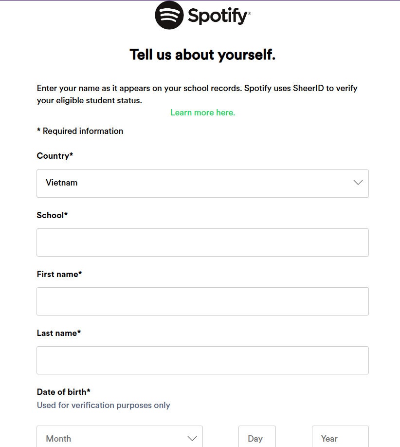

# Spotify Premium - Gói Sinh Viên

Link: https://www.spotify.com/vn-vi/student/

## Giới thiệu

Spotify Premium cho Sinh Viên là gói đăng ký đặc biệt của Spotify, mang đến cho sinh viên đang theo học tại các trường cao đẳng và đại học đủ điều kiện cơ hội thưởng thức âm nhạc trực tuyến chất lượng cao với mức giá ưu đãi . Gói này bao gồm tất cả các lợi ích của Spotify Premium thông thường, cùng với các ưu đãi bổ sung hấp dẫn khác.

## Ưu đãi

Với gói Spotify Premium cho Sinh Viên, bạn sẽ được hưởng:

* **Spotify Premium:** Nghe nhạc không quảng cáo, tải nhạc để nghe offline và chất lượng âm thanh tốt nhất.
* **Giá ưu đãi đặc biệt:** Mức phí hàng tháng thấp hơn so với gói Premium thông thường - 29.500 ₫/ cho 3 tháng đầu và sau đó là 29.500 ₫/tháng.

## Đăng ký

- **Bước 1:** Truy cập trang đăng ký Spotify Premium cho Sinh Viên và chọn quốc gia của bạn.
- **Bước 2:** Tìm kiếm và chọn tên trường học mà bạn đang theo học.
- **Bước 3:** Nhập đầy đủ họ và tên, ngày tháng năm sinh và địa chỉ email sinh viên của bạn.

- **Bước 4:** Sau khi bạn cung cấp thông tin, Spotify sẽ chuyển hướng bạn đến trang của SheerID, một dịch vụ xác thực tài khoản sinh viên. Hãy làm theo hướng dẫn của SheerID để hoàn tất quá trình xác thực.
- **Bước 5:** Chọn phương thức thanh toán bạn muốn sử dụng để hoàn tất đăng ký.
