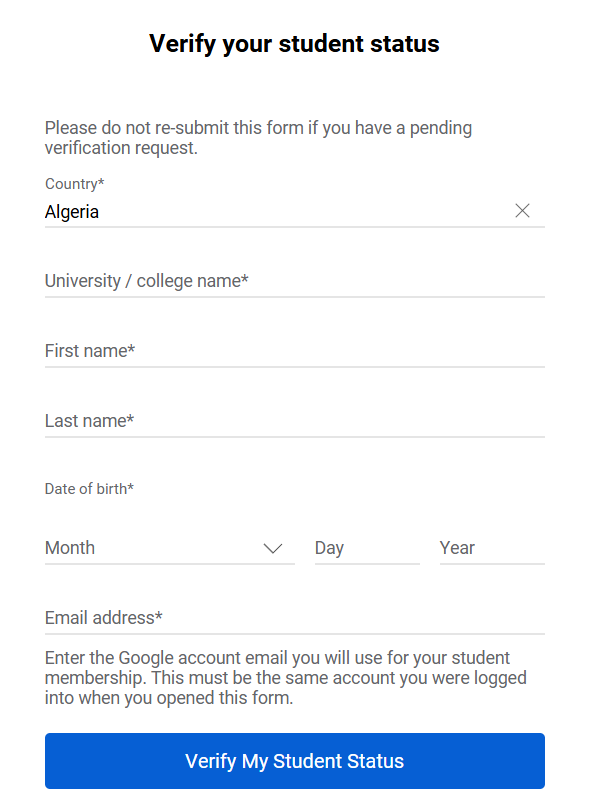

# YouTube Premium - Student Plan

Link: [https://www.youtube.com/premium/student](https://www.youtube.com/premium/student)

## Giới thiệu
Gói YouTube Premium sinh viên dành riêng cho học sinh/sinh viên đang theo học tại các trường đại học, cao đẳng được công nhận. Tận hưởng trải nghiệm YouTube không quảng cáo với mức giá ưu đãi.

## Ưu đãi
* **Giá sinh viên ưu đãi:** 29.000đ/tháng (tiết kiệm 51% so với gói thường 59.000đ)
* **Tính năng cao cấp:**
  - Xem video không quảng cáo
  - Nghe nhạc nền khi tắt màn hình
  - Tải video xem offline
  - YouTube Music Premium miễn phí đi kèm
* **Dùng thử miễn phí:** 1 tháng đầu tiên

## Cách đăng ký
- **Bước 1**: Truy cập [trang đăng ký chính thức](https://www.youtube.com/premium/student)  
- **Bước 2**: Chọn "Việt Nam" làm quốc gia đăng ký  
- **Bước 3**: Nhập đầy đủ thông tin:
   - Họ và tên
   - Ngày tháng năm sinh
   - Email trường (.edu.vn)  
- **Bước 4**: Xác minh tài khoản sinh viên qua SheerID  
- **Bước 5**: Chọn phương thức thanh toán và hoàn tất đăng ký

## Lưu ý quan trọng

- Ưu đãi có giá trị tối đa 4 năm
- Cần xác minh lại sinh viên hàng năm
