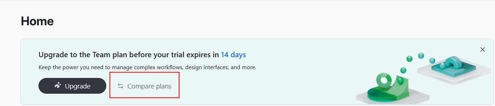
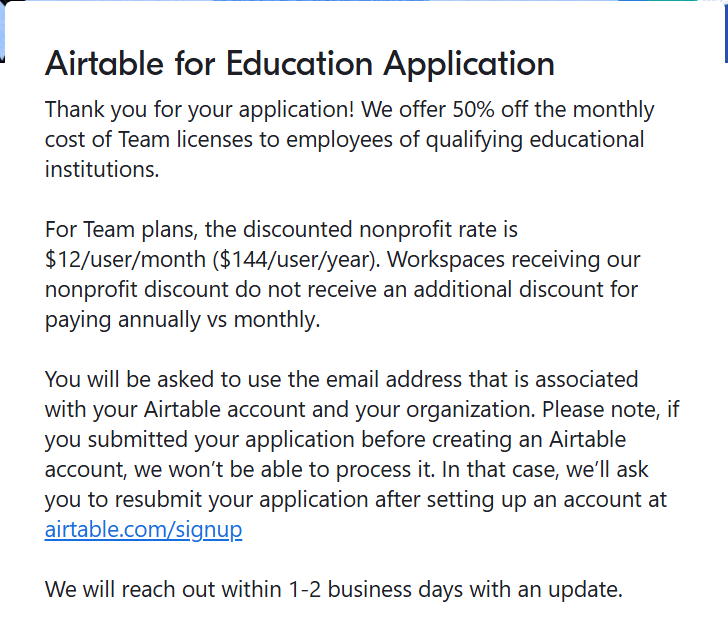

# Airtable Student Plan

Link: https://airtable.com/

## Đăng ký

- Bước 1: Đăng nhập vào Airtable
- Bước 2: Ở trang home chọn Compare Plan

- Bước 3: Kéo xuống dưới cùng và chọn Education Plan

- Bước 4: Điền thông tin vào form gồm:

    - Họ tên, trường học, website trường học, vị trí của bạn trong trường học
    - Email sinh viên
    - Lí do vì sao dùng Airtable
    - Số lượng thành viên
    - Upload thẻ sinh viên, bảng điểm, thời khóa biểu
- Bước 5: Xác nhận
