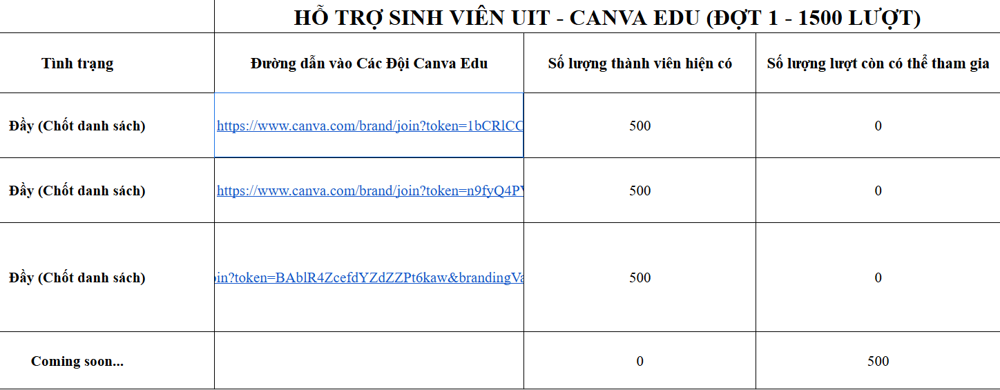

# Canva For Students

Link: [Dành riêng cho sinh viên UIT](https://docs.google.com/spreadsheets/d/1IaZUsbzZto63C2sHaBut_TuYan6GFdk9QAKAiqaHid0/edit?fbclid=IwY2xjawKU5pJleHRuA2FlbQIxMABicmlkETFNUnFaUlNYWHhaRzJtOGlQAR6a3QtE5r_3ZubZ6O977Y_2I9P0yz7NWT_3jKYy8AjU3pMBj4v9C1t4PBwlXw_aem_Bs0LHtdHawi4sxQlpZT8iQ&gid=0#gid=0)

## Đăng ký

- Bước 1: Đăng nhập Canva bằng tài khoản email sinh viên UIT (gm.uit.edu.vn)
- Bước 2: Truy cập vào link trên và chọn team còn chỗ trống

- Bước 3: Test các tính năng như Brand Kit, Magic Write, ... nếu sử dụng được là thành công

## Lưu ý
- Chỉ chấp nhận email sinh viên UIT (gm.uit.edu.vn)
- Chỉ đăng ký được nếu các team trong link trên còn slot
